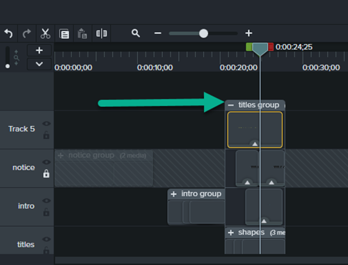

# READ ME

This is the [Camtasia](https://www.techsmith.com/video-editor.html) project that was used to create the intro to SmarttertHealth videos in FY2020. You can use it to create standard intro videos.

## Creating a Standard Intro for your Video

If you simply need to download the project to edit your titles for the intro, perform the following steps.

1. Download the [.zip file](https://github.com/SmartterHealth/camtasia-smartter-health-intro/archive/master.zip) containing the Camtasia project.
2. Extract all files to a working directory.
3. Open the project in Camtasia.
4. In the timeline for the project:
    4.1. Position the playback head around 24:25. This will bring the *titles* group into view.
    4.2. Click the *+* to expand the *titles* group (see Figure 1 below).
    4.3. Double-click the title text you wish to replace, and enter your text.
    4.4. Double-click the subtitle text you wish to replace, and enter your text.
5. Export your intro as an MP4.

You can view the sample intro [here](https://github.com/SmartterHealth/camtasia-smartter-health-intro/blob/master/sample_intro/sample_intro.mp4?raw=true).

*Figure 1 - Expanding the Titles group.*

*Figure 2 - Editing the Title by double-clicking the *title* text to select and edit.*

*Figure 3 - Editing the Suibtitle by double-clicking the *subtitle* text to select and edit.*

## Advanced Edits

If you need to update the template for the Intro Slides, then it is recommended you download [Git](https://git-scm.com/downloads) and clone the project to your local workstation.